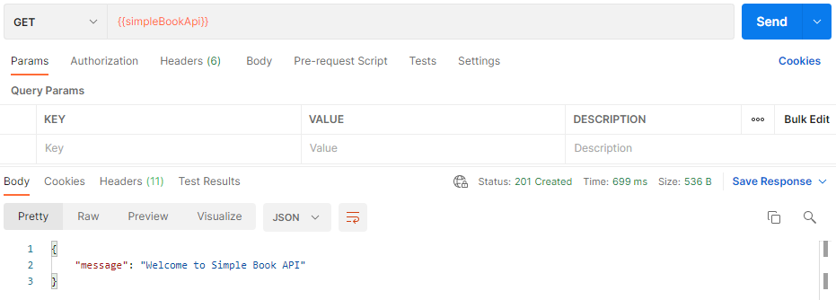
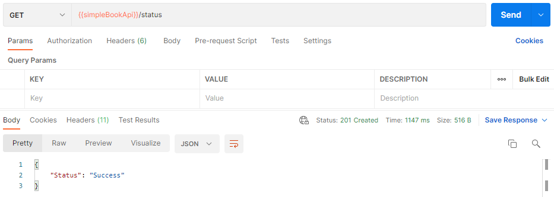
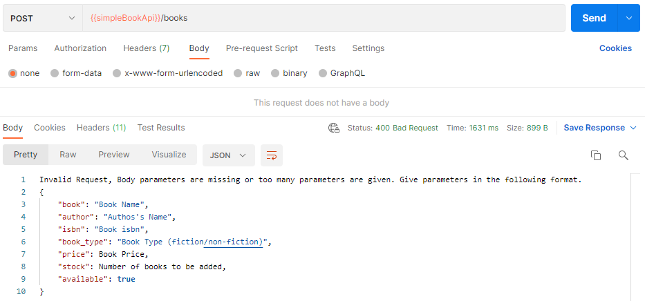
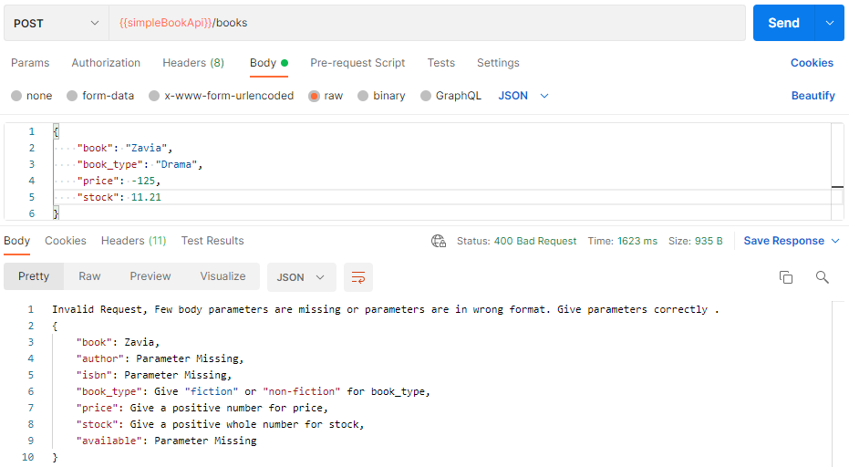
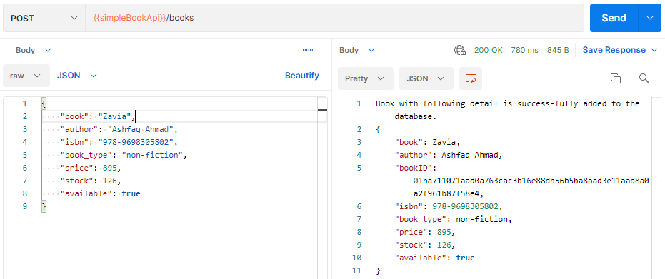
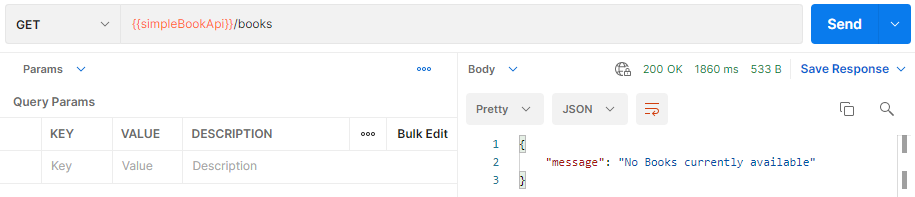
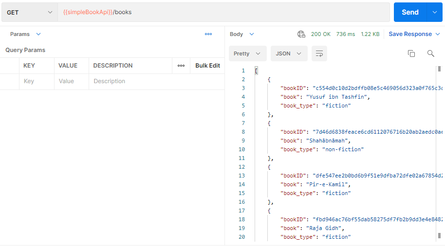
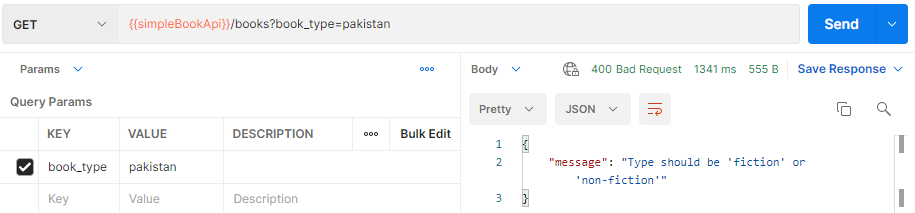
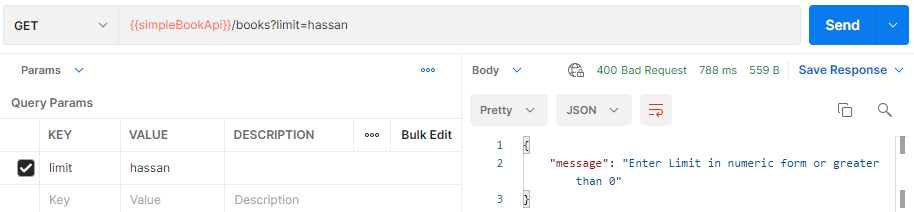
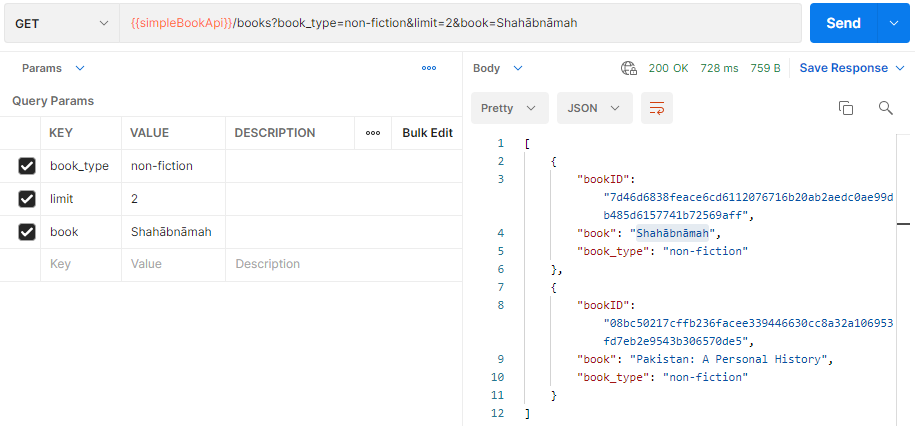

# BootCamp2021 Project04: Simple Book API

By doing this project we are able to learn following:-

- How to create a cdk app
- How to create a lambda function
  - Define lambda handler code
- How to crate a rest api using api gateway
  - Define api lambda integration
  - Add resources to the root
  - Add methods
- Test REST API using postman
  - Get request
  - Post request
    - Request body
- How to create DynamoDB table
  - Put data in table

## Steps to code "Simple Book API"

### 1. Create a basic cdk app

Create and navigate to new directory using `mkdir simple-book-api && cd simple-book-api`. Create a new cdk project using `cdk init app --language typescript`. As typescript is used for coding so transcribing the code to javascript is necessary, one way is to build the app in the end other is to use `npm run watch` to auto compile the code whenever any file is changed so use the latter option. To synthesize the app use `cdk synth` this will output the cloud formation template. Bootstrap the app using `cdk bootstrap`, bootstrapping is necessary only in case when app is deployed for the first time. Deploy the app using `cdk deploy`.

### 2. Create a basic REST API

Purpose of this project is to create a rest api where one can send different requests. So the very first step is to make a rest api (root path) from where one can send different requests. For the very first step create a welcome message lambda function in the stack by updating "lib/simple-book-api-stack.ts". As this project is created using "cdk 2" so no need to install aws modules separately, all of them can be imported from "aws-cdk-lib", for any older version all modules to be installed separately.

```js
import { aws_lambda as lambda } from "aws-cdk-lib";
const welcomeFunction = new lambda.Function(this, "welcomeFunction", {
  functionName: "Welcome-Function-Simple-Book-Api",
  runtime: lambda.Runtime.NODEJS_14_X,
  code: lambda.Code.fromAsset("lambdas"),
  handler: "welcome.handler",
  memorySize: 1024,
});
```

Rest api's can be created using api gateway. Update "lib/simple-book-api-stack.ts" for creating a rest api using api gateway. This will create a new rest api and results in a URL whihc is going to work as the base path for the api.

```js
import { aws_apigateway as apigw } from "aws-cdk-lib";
const api = new apigw.RestApi(this, "simpleBookApi", {
  restApiName: "Simple Book Api",
});
```

When ever one sends a request to the api some lambda function is to be invoked, so create api integration for the lambda function by updating "lib/simple-book-api-stack.ts".

```js
const welcomeFunctionIntegration = new apigw.LambdaIntegration(welcomeFunction);
```

Api is already defined which creates a base URL. Now there is a need of a method on the root path so one is able to send a request and invoke the lambda function. Thus update "lib/simple-book-api-stack.ts" to add GET method to the root path and attach welcome function integration to it.

```js
api.root.addMethod("GET", welcomeFunctionIntegration);
```

Create "lambdas/welcome.ts" to define handler for the welcome lambda function. This will return simple message as response.

```js
export async function handler() {
  try {
    return {
      statusCode: 201,
      body: `{ "message": "Welcome to Simple Book API" }`,
    };
  } catch (error) {
    return {
      statusCode: 500,
      body: `{ "Error": "Error with Simple Book API - Try again later" }`,
    };
  }
}
```

Deploy the app using `cdk deploy`. This will deploy the app on aws and returns the api base URL on console. Deployed stack can be seen in the cloudformation console, lambda in the lambda console and rest api in the apigateway console. API url can also be accessed in api settings in the consoel which will be of the following form

```
https://**********.execute-api.*********.amazonaws.com/prod/
```

Rest API's can be tested by various ways. One is to use "postman". Create a new collection in a postman workspace. Create a new GET request in the collection and provide API URL in it. One can make a new varibale to store the URL so it is easy to use while creating new requests. Send request and after successful execution reponse will be as follows.



While adding methods "GET" option is selected so in case one send any request other than GET will results in a "Missing Authentication Token" message.

### 3. Create resource to check status

Now add a subpath to the root path of the api to check status if the api is working fine or facing any error. For that first update "lib/simple-book-api-stack.ts" and create a new lambda function, create api lambda function integration, add status resource to root path (new path defination) and add a get method on the lambda integartion. Also add CORS options to resource.

```js
const statusFunction = new lambda.Function(this, "statusFunction", {
  functionName: "Status-Function-Simple-Book-Api",
  runtime: lambda.Runtime.NODEJS_14_X,
  code: lambda.Code.fromAsset("lambdas"),
  handler: "status.handler",
  memorySize: 1024,
});
const statusFunctionIntegration = new apigw.LambdaIntegration(statusFunction);
const status = api.root.addResource("status");
status.addMethod("GET", statusFunctionIntegration);
addCorsOptions(status);
```

Cross-origin resource sharing (CORS) is a browser security feature that restricts cross-origin HTTP requests that are initiated from scripts running in the browser. So there is need to define CORS function.

```js
export function addCorsOptions(apiResource: apigw.IResource) {
  apiResource.addMethod(
    "OPTIONS",
    new apigw.MockIntegration({
      integrationResponses: [
        {
          statusCode: "200",
          responseParameters: {
            "method.response.header.Access-Control-Allow-Headers":
              "'Content-Type,X-Amz-Date,Authorization,X-Api-Key,X-Amz-Security-Token,X-Amz-User-Agent'",
            "method.response.header.Access-Control-Allow-Origin": "'*'",
            "method.response.header.Access-Control-Allow-Credentials":
              "'false'",
            "method.response.header.Access-Control-Allow-Methods":
              "'OPTIONS,GET,PUT,POST,DELETE'",
          },
        },
      ],
      passthroughBehavior: apigw.PassthroughBehavior.NEVER,
      requestTemplates: {
        "application/json": '{"statusCode": 200}',
      },
    }),
    {
      methodResponses: [
        {
          statusCode: "200",
          responseParameters: {
            "method.response.header.Access-Control-Allow-Headers": true,
            "method.response.header.Access-Control-Allow-Methods": true,
            "method.response.header.Access-Control-Allow-Credentials": true,
            "method.response.header.Access-Control-Allow-Origin": true,
          },
        },
      ],
    }
  );
}
```

Create "lambdas/status.ts" to define handler for the status lambda function. This will return simple message as response.

```js
export async function handler() {
  try {
    return {
      statusCode: 201,
      body: `{ "Status": "Success" }`,
    };
  } catch (error) {
    return {
      statusCode: 500,
      body: `{ "Status": "Failure" }`,
    };
  }
}
```

Deploy the app using `cdk deploy` and then test the api using postman. For testing create new GET request with `/status` path and send the request.



### 4. Create resource to add new book

Next step is to create a resource so we can add new books to the database. In this project DynamoDB is used as database. Update "lib/simple-book-api-stack.ts" to define a new dynamodb table for storing books.

```js
import { aws_dynamodb as ddb } from "aws-cdk-lib";
const allBooksTable = new ddb.Table(this, "AllBooksTable", {
  tableName: "Simple_Book_Api_All_Books",
  partitionKey: {
    name: "bookID",
    type: ddb.AttributeType.STRING,
  },
});
```

Create a lambda function to add new book to database and grant read write permission for ddb table. Also create lambda integration, resource, method and Cors options. One thing to keep in mind POST method is to be used here as we are adding data to ddb table.

```js
const addBooksFunction = new lambda.Function(this, "addBooksFunction", {
  functionName: "Add-Books-Function-Simple-Book-Api",
  runtime: lambda.Runtime.NODEJS_14_X,
  code: lambda.Code.fromAsset("lambdas"),
  handler: "addBooks.handler",
  memorySize: 1024,
  environment: {
    PRIMARY_KEY_ALL: "bookID",
    TABLE_NAME_ALL: allBooksTable.tableName,
  },
});
allBooksTable.grantReadWriteData(addBooksFunction);
const addBooksFunctionIntegration = new apigw.LambdaIntegration(
  addBooksFunction
);
const books = api.root.addResource("books");
books.addMethod("POST", addBooksFunctionIntegration);
addCorsOptions(books);
```

Install "aws-sdk" using `npm i aws-sdk` as we need to use AWS resources in the lambda function. Create "lambdas/addBooks.ts" to define the handler for addBooks function so new book can be added into the database. New book can be added by provding book data in the request body. There are multiple checks to be implemented.

```js
import * as AWS from "aws-sdk";
import { randomBytes } from "crypto";
const db = new AWS.DynamoDB.DocumentClient();

// enivronment variables
const PRIMARY_KEY_ALL = process.env.PRIMARY_KEY_ALL || "";
const TABLE_NAME_ALL = process.env.TABLE_NAME_ALL || "";

export const handler = async (event: any = {}): Promise<any> => {
  // Check if body parameters are given and number of parameters are as required for the request
  if (!event.body || Object.keys(JSON.parse(event.body)).length > 7) {
    return {
      statusCode: 400,
      body: `Invalid Request, Body parameters are missing or too many parameters are given. Give parameters in the following format.\n{
          "book": "Book Name", 
          "author": "Authos's Name", 
          "isbn": "Book isbn", 
          "book_type": "Book Type (fiction/non-fiction)",
          "price": Book Price, 
          "stock": Number of books to be added, 
          "available": true
        }`,
    };
  }
  // Get book parameters from request body and store them in a varibale
  const item =
    typeof event.body == "object" ? event.body : JSON.parse(event.body);
  // Check if body parameters are in correct form
  if (
    !item.book ||
    !item.author ||
    !item.isbn ||
    !(item.book_type === "fiction" || item.book_type === "non-fiction") ||
    !!(isNaN(item.price) || item.price < 0) ||
    !!(isNaN(item.stock) || item.stock % 1 != 0 || item.stock < 0) ||
    !item.available
  ) {
    return {
      statusCode: 400,
      body: `Invalid Request, Few body parameters are missing or parameters are in wrong format. Give parameters correctly .\n{
        "book": ${item.book || "Parameter Missing"}, 
        "author": ${item.author || "Parameter Missing"}, 
        "isbn": ${item.isbn || "Parameter Missing"}, 
        "book_type": ${
          !item.book_type
            ? "Parameter Missing"
            : !(
                item.book_type === "fiction" || item.book_type === "non-fiction"
              )
            ? `Give "fiction" or "non-fiction" for book_type`
            : item.book_type
        },
        "price": ${
          !item.price
            ? "Parameter Missing"
            : !!(isNaN(item.price) || item.price < 0)
            ? "Give a positive number for price"
            : item.price
        }, 
        "stock": ${
          !item.stock
            ? "Parameter Missing"
            : !!(isNaN(item.stock) || item.stock % 1 != 0 || item.stock < 0)
            ? "Give a positive whole number for stock"
            : item.price
        }, 
        "available": ${item.available || "Parameter Missing"}
      }`,
    };
  }
  // Asign book_id and set params to be passed to ddb operation
  item[PRIMARY_KEY_ALL] = randomBytes(32).toString("hex");
  const params = {
    TableName: TABLE_NAME_ALL,
    Item: item,
  };
  // When all conditions are good to go, put data in the table and return item as output
  // in case of error return error
  try {
    await db.put(params).promise();
    return {
      statusCode: 200,
      body: `Book with following detail success-fully added to the database.\n{
        "book": ${item.book}, 
        "author": ${item.author}, 
        "bookID":${item.bookID},
        "isbn": ${item.isbn}, 
        "book_type": ${item.book_type},
        "price": ${item.price}, 
        "stock": ${item.stock}, 
        "available": ${item.available}
      }`,
    };
  } catch (err) {
    console.log("DynamoDB error: ", err);
    return { statusCode: 500, body: err };
  }
};
```

Deploy the app using `cdk deploy`, this all our changes will be deployed and a new DynamoDB table will be created as well. For testing create new POST request on postman with sub path `/books`.

When no body is given sending this request will return an error In case more than requiered parameters are given in body again same error will occur.



If some of the parameters are missing or in wrong format another error will be encountered.



If all the conditions are staisfied book will be added to table.



If there is some error with DynamoDB it will be returned as well.

### 5. Create resource to list all books

Next step is to create a resource so we can get all books from the database. Update "lib/simple-book-api-stack.ts" to create a lambda function to get all books from database and grant read write permission for ddb table. Also create lambda integration and method.. One thing to keep in mind GET method is to be used here as we are getting data from ddb table. While defining lambda function need to define environment variables and request parameters while adding a method to books resource.

```js
const allBooksFunction = new lambda.Function(this, "allBooksFunction", {
  functionName: "All-Books-Function-Simple-Book-Api",
  runtime: lambda.Runtime.NODEJS_14_X,
  code: lambda.Code.fromAsset("lambdas"),
  handler: "allBooks.handler",
  memorySize: 1024,
  environment: {
    TABLE_NAME_ALL: allBooksTable.tableName,
  },
});
allBooksTable.grantReadWriteData(allBooksFunction);
const allBooksFunctionIntegration = new apigw.LambdaIntegration(
  allBooksFunction
);
books.addMethod("GET", allBooksFunctionIntegration, {
  requestParameters: {
    "method.request.querystring.book_type": false,
    "method.request.querystring.limit": false,
  },
});
```

Create "lambdas/allBooks.ts" to define the handler for allBooks function so books can be listed from database. When no query parameters are given all books will be rturned. We can also query based on book type and number of books.

```js
import * as AWS from "aws-sdk";

const TABLE_NAME_ALL = process.env.TABLE_NAME_ALL || "";

const db = new AWS.DynamoDB.DocumentClient();

export const handler = async (event: any, context: any): Promise<any> => {
  const params = {
    TableName: TABLE_NAME_ALL,
    ProjectionExpression: "book, bookID, book_type",
  };
  try {
    const response = await db.scan(params).promise();
    // In case there is no book in data base
    if (response.Count === 0) {
      return {
        statusCode: 200,
        body: `{ "message": "No Books currently available" }`,
      };
    }
    // When there is limit in the query
    if (
      event.queryStringParameters &&
      event.queryStringParameters.limit &&
      !event.queryStringParameters.book_type
    ) {
      if (!parseInt(event.queryStringParameters.limit)) {
        return {
          statusCode: 200,
          body: `{ "message": "Enter Limit in numeric form or greater than 0" }`,
        };
      } else {
        if (response.Items) {
          return {
            statusCode: 200,
            body: JSON.stringify(
              response.Items.slice(
                0,
                Math.abs(event.queryStringParameters.limit)
              )
            ),
          };
        }
      }
    }
    // When there is book_type in query
    if (
      event.queryStringParameters &&
      !event.queryStringParameters.limit &&
      event.queryStringParameters.book_type
    ) {
      if (
        event.queryStringParameters.book_type.toLowerCase() !== "fiction" &&
        event.queryStringParameters.book_type.toLowerCase() !== "non-fiction"
      ) {
        return {
          statusCode: 200,
          body: `{ "message": "Type should be 'fiction' or 'non-fiction'" }`,
        };
      } else {
        if (response.Items) {
          if (
            response.Items.filter(
              (item) =>
                item.book_type ===
                event.queryStringParameters.book_type.toLowerCase()
            ).length === 0
          ) {
            return {
              statusCode: 200,
              body: `{ "message": "There is no book of type ${event.queryStringParameters.book_type.toLowerCase()}" }`,
            };
          }
          return {
            statusCode: 200,
            body: JSON.stringify(
              response.Items.filter(
                (item) =>
                  item.book_type ===
                  event.queryStringParameters.book_type.toLowerCase()
              )
            ),
          };
        }
      }
    }
    // When there is both limit and book_type in the query
    if (
      event.queryStringParameters &&
      event.queryStringParameters.limit &&
      event.queryStringParameters.book_type
    ) {
      if (
        event.queryStringParameters.book_type.toLowerCase() !== "fiction" &&
        event.queryStringParameters.book_type.toLowerCase() !== "non-fiction"
      ) {
        return {
          statusCode: 200,
          body: `{ "message": "Type should be 'fiction' or 'non-fiction'" }`,
        };
      } else {
        if (response.Items) {
          if (
            response.Items.filter(
              (item) =>
                item.book_type ===
                event.queryStringParameters.book_type.toLowerCase()
            ).length === 0
          ) {
            return {
              statusCode: 200,
              body: `{ "message": "There is no book of type ${event.queryStringParameters.book_type.toLowerCase()}" }`,
            };
          } else {
            const results = response.Items.filter(
              (item) =>
                item.book_type ===
                event.queryStringParameters.book_type.toLowerCase()
            );
            console.log(results);
            if (!parseInt(event.queryStringParameters.limit)) {
              return {
                statusCode: 200,
                body: `{ "message": "Enter Limit in numeric form or greater than 0" }`,
              };
            } else {
              if (results) {
                return {
                  statusCode: 200,
                  body: JSON.stringify(
                    results.slice(
                      0,
                      Math.abs(event.queryStringParameters.limit)
                    )
                  ),
                };
              }
            }
          }
        }
      }
    }
    // No query parameters
    return { statusCode: 200, body: JSON.stringify(response.Items) };
  } catch (err) {
    console.log("DynamoDB error: ", err);
    return { statusCode: 500, body: err };
  }
};
```

Deploy the app using `cdk deploy` and then test it using postman.For testing create new GET request on postman with sub path `/books`.

When there are no books stored in the dynamoDB table a message will be returned stating no books in table. And if there are books in the database all books will be displayed





We can also add query parameters and when query parameters are given but book_type mismatch or limit not numeric again an error will be returned.





Adding correct query parameters in correct format will return results as requested and one more thing any query other than book_type and limit will not be processed.


